# Movies

## Présentation Méthodologie:

CLIENT : Christophe Chevalier
Service : FLOUPICS
Domaine Service  : VOD
Résalisé Par : TEAM B PRODUCTIONS ( Lamia, Alicia, Matthias, Mayel)

    I) Rappel problématique et besoin de client:
Le client potentiel envisage de se lancer dans le domaine de la VOD en créant un nouveau service.
Il sollicite notre expertise sur l’analyse de fichier csv fourni par lui.
Ce set de données est téléchargeable à partir du lien suivant: <http://grouplens.org/datasets/>.
    
    II) Récupération du projet sur GitHub

GitHub est une application web performante pour le travail collaboratif.
Il faut se créer un compte GitHub pour pouvoir profiter de ses fonctionnalités.
Notre projet se trouve à l'adresse suivante:
https://github.com/Lamia-git/Movies

    III) Documentation technique.

Pour faciliter l'analyse des données nous avons créé la base de données moviesdb.db (dans le répertoire BDD) qui est l'agrégat des 4 fichiers csv: movies.csv, links.csv, tags.csv et ratings.csv.
Pour réaliser notre étude nous avons utilisé deux technologies: DB BROWSER LITE et JUPYTER LAB.

          1) SQL via le logiciel DB browser lite

Ce logiciel nous permet d'interroger les bases de données complexes via des requêtes SQL.

               a) Téléchargement

Pour installer ce logiciel, il suffit de cliquer sur le lien suivant et de sélectionner la version compatible avec son système d'exploitation (de préférence le lien contenant "Standart installer"):
- https://sqlitebrowser.org/dl/

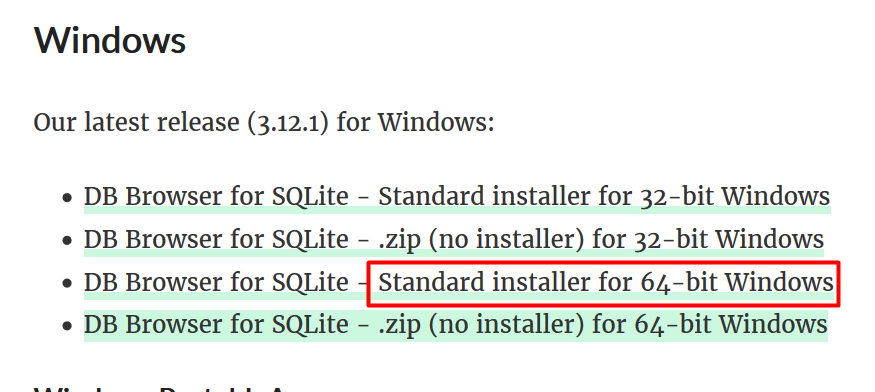
Par exemple si vous êtes sous  windows (la version 64bits)

https://www.youtube.com/watch?v=CDen1TavGQ8 (tutorial)

               b) installation

Une fois le programme installé, il suffit de le lancer et de suivre les instructions d'installation (default settings).

               c) utilisation

après ouverture du logiciel, cliquez sur "ouvrir une nouvelle base de donnée"

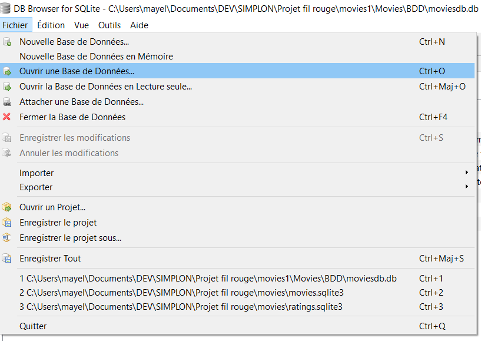

--> ouvrez le fichier moviesdb.db dans le répertoire BDD

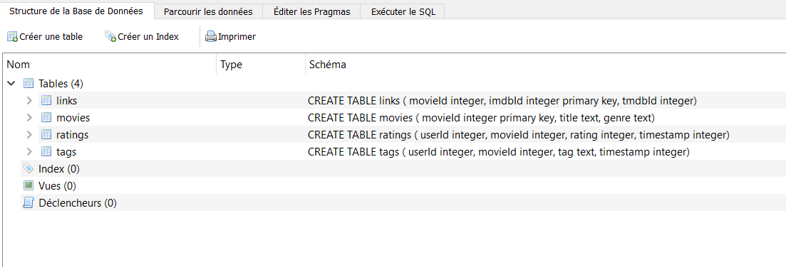

   - Grâce à l'onglet "Structure la Base de Données" vous avez un aperçu des différents tableaux qui constituent moviesdb.db
   - L'onglet "Parcourir les données" nous donne une vue directe sur les données de chaque tableaux.
   - C'est dans l'onglet "exécutez sql" que nous allons pouvoir réaliser les requêtes sql pour interroger les tableaux.
   
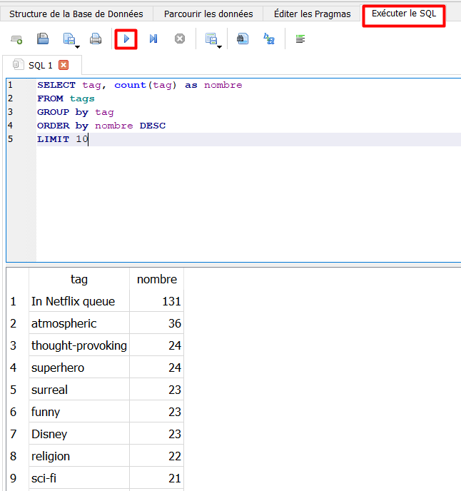

           2) Jupyter Lab         

C'est un outil qui va vous permettre de réaliser des scripts python dans un environnement dit virtuel.
Les fichiers jupyter sont directement lisibles sur GitHub.

            a) installation de python

Pour réaliser les lignes de code en python, vous devez commencer par télécharger Python 3 au lien suivant:
https://www.python.org/downloads/

Après téléchargement du programme, exécutez le et suivez les instructions d’installations.

            b) installation de jupyterlab et installation de l’environnement de travail

Toutes les commandes suivante peuvent être réalisé sous le Terminal (ligne de commande).

-- Attention: nous utilisons git bash, si vous utilisez une autre version (ex. powershell), vous devez adapter les commandes, n’hésitez pas à nous contacter en cas de problème.          

Vous pouvez installer jupyterlab via la ligne de commande dans le terminal et le lancer, voici les étapes nécessaires:

 - création d’un répertoire Jupyterlab/ en local via l’explorateur
 - ouverture du terminal git bash
 - se placer dans le bon répertoire grâce à la commande cd
 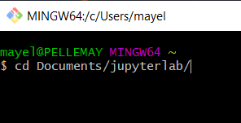
 - environnement virtuel, tapez dans le terminal: python -m venv env 
 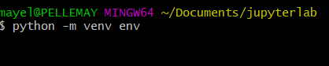
 - activation de l’environnement virtuel, tapez dans le terminal: source env/scripts/activate
 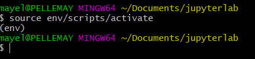
 - (si nécessaire) mis à jours du pip, tapez dans le terminal: pip install --upgrade pip
 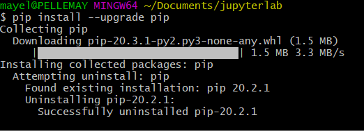
 - installation de jupiter lab, tapez dans le terminal: pip install requirement.txt
 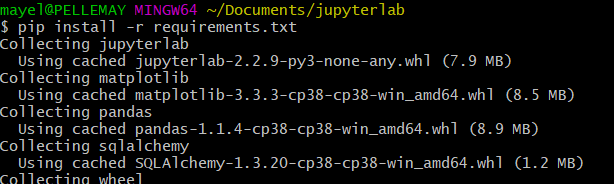
 - Lancer Jupyterlab : jupyter lab
 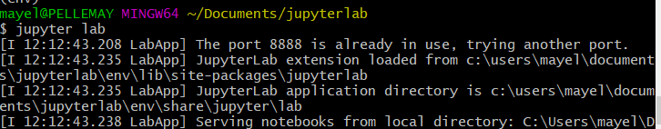
 - sélectionnez l'icone python 3 et vous êtes prêt à utiliser JupyterLab
 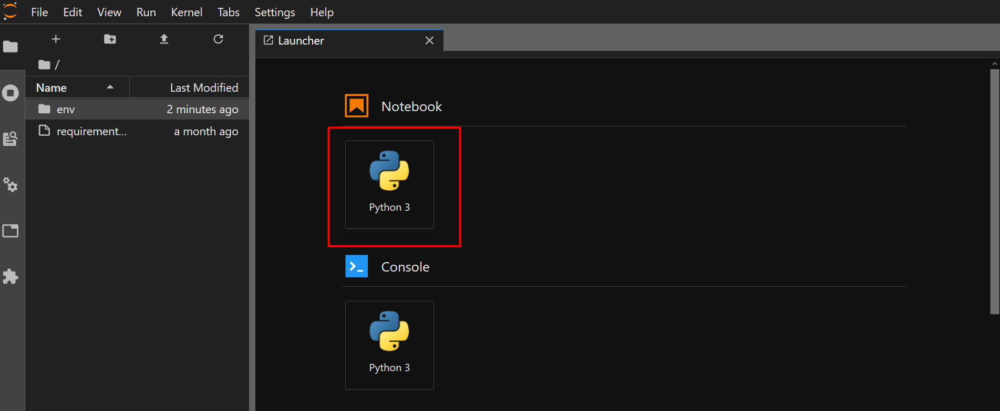
 
Une fois le notebook lancé on peut commencer notre exploitation de données. 
Voir le document Floupics.ipynb pour le script qui permet l’insertion de nos 4 bases dans moviesdb.db. 
Voir le documents Queries_test.ipynb pour toutes les requêtes permettant notre analyse de la table moviesdb.db . 

En cas de difficulté, vous pouvez contacter notre service clientèle à l’adresse suivante: contact@teambprod.com 

