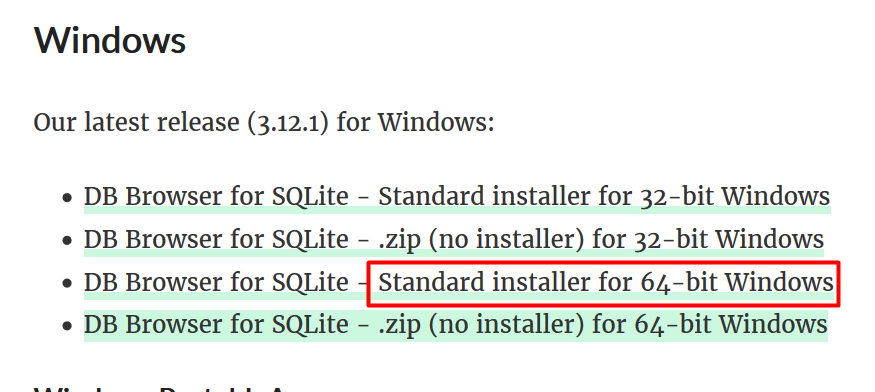
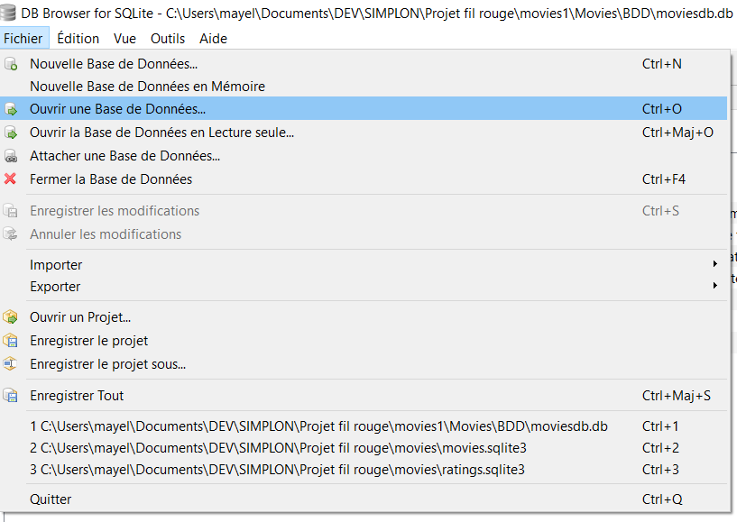
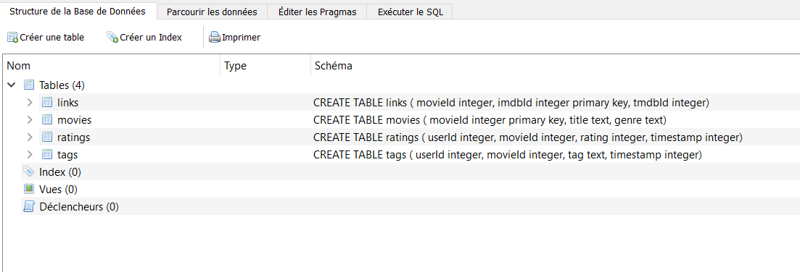
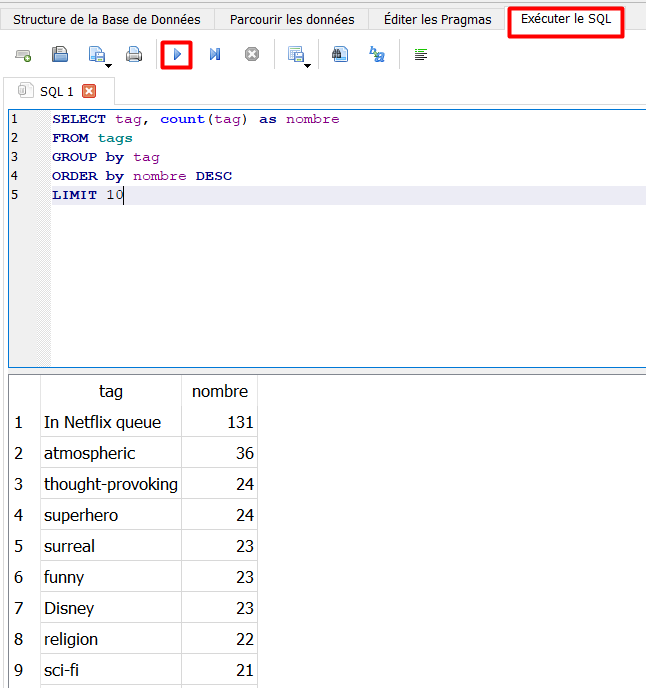

# Movies

Présentation

CLIENT : Christophe Chevalier
Service : FLOUPICS
Domaine Service  : VOD
Résalisé Par : TEAM B PRODUCTIONS ( Lamia, Alicia, Matthias, Mayel)

    I) Problématique  et besoin de client:
    
Le client potentiel envisage de se lancer dans le domaine de la VOD en créant un nouveau service:
le potentiel client souhaite d'abord faire une étude de marché préliminaire
Identifier le potentiel de la base de donnée : l'identification des films les plus populaires (nombre de vue, bonne note) et de potentielles niches cinématographiques (genre/acteur/réalisateur)
Comparaison avec l’offre actuelle 

    II) Récupération du projet sur git hub

Git hub est une application web performante pour le travail collaboratif.
Il faut se créer un compte git hub pour pouvoir profiter de ses fonctionnalités.

Notre projet se trouve à l'adresse suivante:
https://github.com/Lamia-git/Movies

    III) Documentation technique.

Pour faciliter l'analyse des données nous avons créé la base de données moviesdb.db (dans le répertoire BDD) qui est l'agrégat des 4 fichiers csv: movies.csv, links.csv, tags.csv et ratings.csv.
Pour réaliser notre étude nous avons utilisé deux technologies: DB BROWSER LITE et JUPYTER LAB.

          1) SQL via le logiciel DB browser lite

Ce logiciel nous permet d'intérroger les bases de données complexes via des requêtes SQL.

               a) Téléchargement
Pour installer ce logiciel, il suffit de cliquer sur le lien suivant et de sélectionner la version compatible avec son système d'exploitation (de prérence le lien contenant "Standart installer"):
- https://sqlitebrowser.org/dl/

Par exemple si vous êtes sous  windows (la version 64bits) 

https://www.youtube.com/watch?v=CDen1TavGQ8 (tutorial)

               b) installation
Une fois le programme installé, il suffit de le lancer et de suivre les instructions d'installation (default settings).

               c) utilisation
après ouverture du logiciel, cliquez sur "ouvrir une nouvelle base de donnée"

--> ouvrez le fichier moviesdb.db dans le répertoire BDD

   - Grâce à l'onglet "Structure la Base de Données" vous avez un aperçu des différents tableaux qui constituent moviesdb.db
   - L'onglet "Parcourir les données" nous donne une vue direct sur les données de chaque tableaux.
   - C'est dans l'onglet "exécutez sql" que nous allons pouvoir réaliser les requêtes sql pour intérroger les tableaux.
   

           2) Jupyter Lab
        
C'est un outil qui va vous permettre de réaliser des scripts python dans un environnement dit virtuel.
Les fichiers jupyter sont directement lisible sur git hub.

            a) installation de python

https://www.python.org/downloads/

            b) installation de jupyterlab
            
Vous pouvez installer jupyterlab via la ligne de commande dans le terminal:
$ pip install --jupyterlab
$ jupyter lab